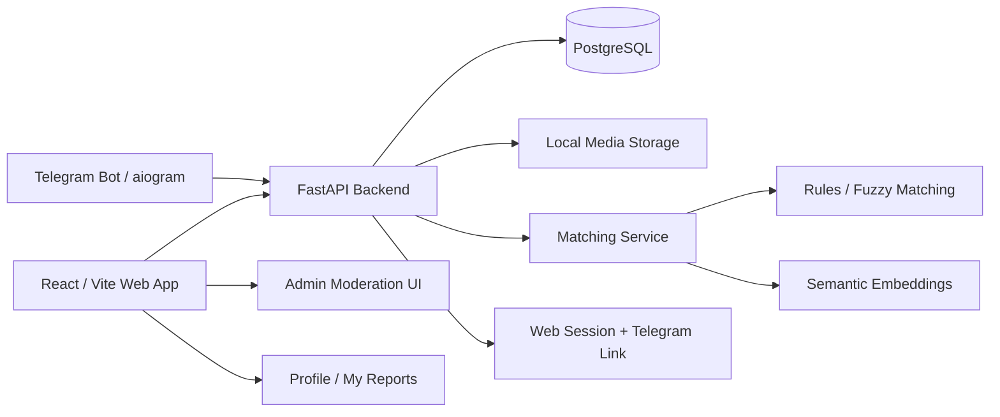

<p align="right">
  <b>Русский</b> · <a href="README.en.md">English</a>
</p>

# Lost & Found Board

<p align="center">
  <b>Web + Telegram платформа для сопоставления потерянных и найденных вещей</b><br />
  Создание объявлений · Поиск совпадений · Управление claims · Безопасная модерация
</p>

<p align="center">
  <a href="https://fastapi.tiangolo.com/"></a>
  <a href="https://react.dev/"></a>
  <a href="https://vite.dev/"></a>
  <a href="https://www.python.org/"></a>
  <a href="https://www.postgresql.org/"></a>
  <a href="https://www.sqlalchemy.org/"></a>
  <a href="https://aiogram.dev/"></a>
  <a href="https://www.docker.com/"></a>
</p>

## Обзор

Lost & Found Board — мой личный full-stack проект для сообществ, которым нужна единая, доступная для поиска и модерируемая система потерянных и найденных вещей. Проект объединяет web-интерфейс, Telegram-бота, backend API, PostgreSQL, обработку изображений, matching вещей, claim workflow, идентификацию через Telegram, admin moderation и Docker-based deployment.

Проект рассчитан на университеты, общежития, офисы, мероприятия и campus communities, где объявления о потерянных и найденных вещах обычно разбросаны по чатам и личным сообщениям.

## Проблема продукта

Информация о потерянных и найденных вещах часто фрагментирована:

- пользователи публикуют объявления в разных чатах;
- владельцам и нашедшим сложно обнаруживать подходящие друг другу объявления;
- дубликаты и подозрительные публикации сложно модерировать;
- передача вещи между владельцем и нашедшим не структурирована;
- Telegram удобен для пользователей, но web-интерфейс лучше подходит для просмотра и администрирования.

Lost & Found Board решает это, централизуя объявления и связывая web-приложение с Telegram-ботом.

## Что демонстрирует проект

- **Backend product development** с FastAPI, SQLAlchemy, PostgreSQL, Alembic, typed schemas и service-layer logic.
- **Full-stack delivery** с React/Vite frontend, REST API integration, карточками вещей, формами, profile pages, admin views и image uploads.
- **Telegram automation** с aiogram, command handlers, FSM-based созданием объявлений, inline keyboards, загрузкой фото, session linking, item management и claim actions.
- **Matching и search logic** с keyword/fuzzy scoring, category/location signals, fallback на semantic embeddings, confidence levels и объяснимыми match reasons.
- **Trust и moderation features**: Telegram-linked sessions, CSRF-aware web sessions, rate limits, abuse events, audit events, moderation statuses, admin queues и bulk actions.
- **Готовность к deployment** с Docker Compose сервисами для PostgreSQL, backend, web, опционального bot profile, health checks, persistent volumes и environment-based configuration.

## Скриншоты

<p align="center">
  
  
</p>

## Архитектура



## Основные приложения

| Область | Путь | Назначение |
|---|---|---|
| Backend API | `backend/` | FastAPI-сервис для объявлений, поиска, smart matching, claims, auth/session linking, профиля, moderation, audit, media и readiness endpoints. |
| Web app | `frontend/` | React/Vite-интерфейс для просмотра и создания объявлений, просмотра matches, управления своими объявлениями, редактирования профиля и admin moderation. |
| Telegram bot | `bot/` | aiogram-бот для создания объявлений, поиска вещей, управления своими items, linking web sessions, просмотра claims и жалоб на подозрительные объявления. |
| Deployment | `docker-compose.yml`, Dockerfiles | Docker Compose runtime для PostgreSQL, backend, web, опционального bot service, persistent volumes и health checks. |
| Screenshots | `screenshots/` | Demo-изображения, используемые в README. |

## Возможности продукта

### Web app

- Просмотр lost/found объявлений с filters, categories, search и item detail pages.
- Создание lost/found объявлений с title, category, location, description, contact data и необязательной загрузкой изображения.
- Просмотр match suggestions для объявлений.
- Управление своими объявлениями в **My Reports**: resolve, reopen, delete и отслеживание lifecycle status.
- Profile page для сохранённых contact/address данных, используемых в item и claim flows.
- Telegram link flow для доверенных ownership actions.
- Admin moderation interface для авторизованных Telegram-linked admins/moderators.

### Backend API

- Модель lifecycle объявления: `active`, `resolved`, `deleted`.
- Moderation statuses: `pending`, `approved`, `rejected`, `flagged`.
- Lost/found endpoints, image upload, filtering, search, smart search, category suggestions и управление личными объявлениями.
- Claim workflow: create, approve, reject, cancel, complete и mark as not a match.
- Rate limiting и anti-abuse events для создания объявлений, image upload, smart search, category suggestions, claim actions и admin/audit операций.
- Audit events, moderation signals, moderation statistics, admin queue summaries и bulk moderation/lifecycle actions.
- Health и readiness endpoints для deployment checks.

### Matching engine

Matching service комбинирует несколько сигналов вместо одного текстового сравнения:

- требование противоположного lost/found статуса;
- совместимость category и category-family;
- keyword overlap и fuzzy similarity заголовка/локации;
- сигналы object type, brand, color, model и distinctive tokens;
- опциональные semantic embeddings через `fastembed`;
- contradiction penalties для конфликтующих object/color сигналов;
- confidence levels и понятные человеку match reasons.

### Telegram bot

- `/new` — пошаговый мастер создания объявления со status, title, category, location, description, contact и optional photo step.
- `/search`, `/list`, `/lost`, `/found` — команды просмотра объявлений.
- `/myitems` — actions для просмотра matches, resolve, reopen и delete.
- `/link <code>` — привязка Telegram identity к web session.
- `/claims` и inline claim actions для item handoff workflow.
- `/flag` — жалоба на подозрительные объявления.
- Inline keyboards для просмотра submissions, item actions, claim actions и location/route helpers.

## Технологический стек

| Слой | Технологии |
|---|---|
| Backend | Python, FastAPI, SQLAlchemy, Alembic, Pydantic Settings, Uvicorn |
| Database | PostgreSQL 16, SQLAlchemy models, migrations |
| Search / matching | rapidfuzz, fastembed, hybrid rule-based + semantic scoring |
| Frontend | React, TypeScript, Vite, React Router, Axios |
| Telegram bot | aiogram 3, httpx, FSM states, inline keyboards |
| Media | multipart uploads, local media volume, temp/finalized cleanup |
| Security / trust | Telegram-linked sessions, CSRF-aware cookies, internal API token, admin allowlist, rate limits |
| Testing / quality | pytest, httpx test client, TypeScript build |
| Infrastructure | Docker, Docker Compose, health checks, persistent volumes |

## Структура репозитория

```text
Lost-Found-Board/
  backend/            # FastAPI backend, SQLAlchemy models, services, schemas, migrations
  frontend/           # React/Vite web application
  bot/                # Telegram bot built with aiogram
  screenshots/        # README screenshots
  docker-compose.yml  # PostgreSQL + backend + web + optional bot runtime
  .env.example        # Environment template
```

## Быстрый старт

### Требования

- Docker и Docker Compose
- Git
- Telegram bot token — только если нужно запускать бота

### Клонирование репозитория

```bash
git clone https://github.com/Leo0742/Lost-Found-Board.git
cd Lost-Found-Board
```

### Настройка окружения

```bash
cp .env.example .env
```

Для local development значений по умолчанию достаточно для запуска web app, backend и database. Для production-like использования задайте надёжные значения:

- `POSTGRES_PASSWORD`
- `INTERNAL_API_TOKEN`
- `ADMIN_SECRET`
- `ADMIN_TELEGRAM_USER_IDS`
- `TELEGRAM_BOT_TOKEN`, если bot включён
- `APP_ENV=prod`
- `STRICT_INTERNAL_TOKEN=true`

### Запуск через Docker Compose

Запуск database, backend и web app:

```bash
docker compose up -d --build db backend web
```

Опциональный Telegram bot:

```bash
docker compose --profile bot up -d --build bot
```

### Проверка runtime

```bash
docker compose ps
curl -f http://localhost/api/ready
```

URL по умолчанию:

| Сервис | URL |
|---|---|
| Web UI | `http://localhost` |
| API docs | `http://localhost/api/docs` |
| Backend readiness | `http://localhost/api/ready` |

## Заметки по локальной разработке

Предпочтительный способ — Docker Compose, потому что он запускает ту же service topology, что используется при deployment: database, backend, web, shared media volume и optional bot.

Возможен и ручной локальный workflow:

- backend: Python virtual environment + FastAPI/Uvicorn;
- frontend: `npm install` / `npm run dev` внутри `frontend/`;
- bot: Python virtual environment + `aiogram` runtime.

## Основные operational checks

После запуска базовая end-to-end проверка:

1. Создать одно `lost` и одно `found` объявление.
2. Открыть item details и убедиться, что возвращаются match suggestions.
3. Привязать Telegram к web session с помощью сгенерированного кода.
4. Управлять объявлениями через **My Reports** или Telegram-команду `/myitems`.
5. Создать и завершить claim между противоположными lost/found объявлениями.
6. Если bot включён, проверить `/start`, `/new`, `/search`, `/myitems` и `/claims`.

## Статус

Это активный личный portfolio project. Основные web, backend, Telegram bot, Docker runtime, report lifecycle, matching, moderation и claim workflows реализованы. Возможные будущие улучшения: external object storage, native mobile apps, более развитые OAuth options и production monitoring integrations.

## Почему проект важен для технического обзора

Для рекрутеров и инженерных ревьюеров проект демонстрирует практический опыт в:

- backend API design с FastAPI, SQLAlchemy, PostgreSQL и service-layer architecture;
- full-stack feature delivery через backend, frontend, Telegram bot и deployment;
- search/matching logic с explainable scoring и optional semantic embeddings;
- session/security задачах: CSRF-aware cookies, Telegram-linked identity, internal tokens, rate limits, admin allowlists и audit events;
- Dockerized deployment с health checks, persistent volumes и optional service profiles;
- product thinking вокруг реальных пользовательских workflows: reporting, matching, claiming, moderation и handoff.
