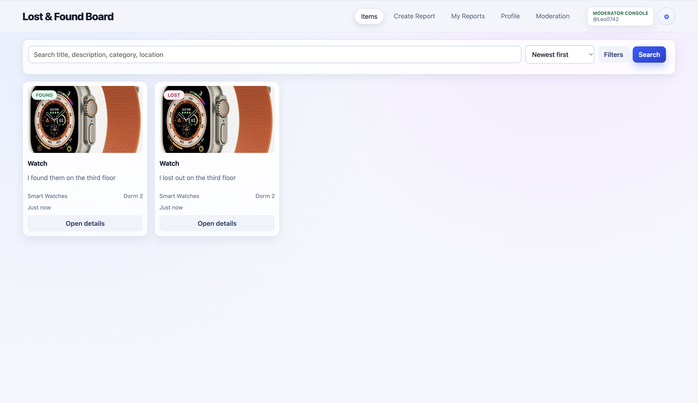
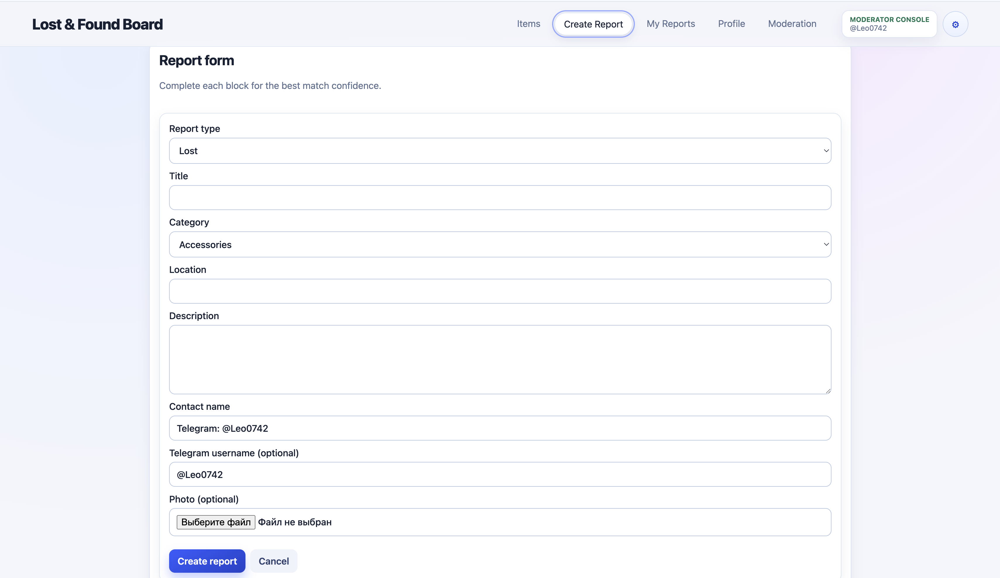
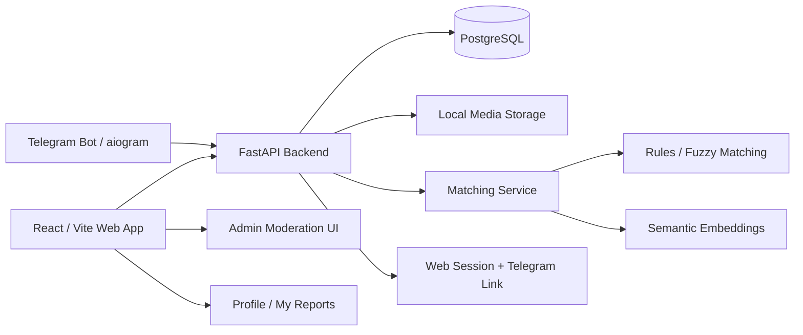

# Lost & Found Board

<p align="center">
  <b>Full-stack lost-and-found platform with web app, Telegram bot, matching, claims, moderation, and Docker deployment</b><br />
  FastAPI · React/Vite · PostgreSQL · SQLAlchemy · Telegram Bot · Semantic Search · Docker Compose
</p>

<p align="center">
  <a href="https://fastapi.tiangolo.com/"></a>
  <a href="https://react.dev/"></a>
  <a href="https://vite.dev/"></a>
  <a href="https://www.python.org/"></a>
  <a href="https://www.postgresql.org/"></a>
  <a href="https://www.sqlalchemy.org/"></a>
  <a href="https://aiogram.dev/"></a>
  <a href="https://www.docker.com/"></a>
</p>

## Overview

Lost & Found Board is my personal full-stack project for communities that need a shared, searchable, and moderated lost-and-found system. It combines a web interface, Telegram bot, backend API, PostgreSQL database, image handling, item matching, claim workflow, Telegram-linked identity, admin moderation, and Docker-based deployment.

The project is designed for places like universities, dormitories, offices, events, and campus communities where lost/found reports are usually scattered across chats and personal messages.

## Product problem

Lost-and-found information is often fragmented:

- users post reports in different chats;
- owners and finders cannot easily discover matching reports;
- duplicate reports and suspicious submissions are hard to moderate;
- handoff between the owner and finder is not structured;
- Telegram is convenient for users, but a web interface is better for browsing and administration.

Lost & Found Board solves this by centralizing reports and connecting the web app with a Telegram bot.

## What this project demonstrates

- **Backend product development** with FastAPI, SQLAlchemy, PostgreSQL, Alembic, typed schemas, and service-layer logic.
- **Full-stack delivery** with a React/Vite frontend, REST API integration, item cards, forms, profile pages, admin views, and image uploads.
- **Telegram automation** with aiogram, command handlers, FSM-based report creation, inline keyboards, photo upload, session linking, item management, and claim actions.
- **Matching and search logic** with keyword/fuzzy scoring, category/location signals, semantic embedding fallback, confidence levels, and explainable match reasons.
- **Trust and moderation features**: Telegram-linked sessions, CSRF-aware web sessions, rate limits, abuse events, audit events, moderation statuses, admin queues, and bulk actions.
- **Deployment readiness** with Docker Compose services for PostgreSQL, backend, web, optional bot profile, health checks, persistent volumes, and environment-based configuration.

## Screenshots

<p align="center">
  
  
</p>

## Architecture



## Main applications

| Area | Path | Purpose |
|---|---|---|
| Backend API | `backend/` | FastAPI service for reports, search, smart matching, claims, auth/session linking, profile, moderation, audit, media, and readiness endpoints. |
| Web app | `frontend/` | React/Vite interface for browsing, creating reports, viewing matches, managing user reports, editing profile data, and admin moderation. |
| Telegram bot | `bot/` | aiogram bot for creating reports, searching items, managing personal items, linking web sessions, viewing claims, and reporting suspicious items. |
| Deployment | `docker-compose.yml`, Dockerfiles | Docker Compose runtime for PostgreSQL, backend, web, optional bot service, persistent volumes, and health checks. |
| Screenshots | `screenshots/` | Demo images used in this README. |

## Product features

### Web app

- Browse lost/found reports with filters, categories, search, and item detail pages.
- Create lost/found reports with title, category, location, description, contact data, and optional image upload.
- View match suggestions for item reports.
- Manage personal reports in **My Reports**: resolve, reopen, delete, and track lifecycle status.
- Profile page for saved contact/address data used in item and claim flows.
- Telegram link flow for trusted ownership actions.
- Admin moderation interface for authorized Telegram-linked admins/moderators.

### Backend API

- Report lifecycle model: `active`, `resolved`, `deleted`.
- Moderation statuses: `pending`, `approved`, `rejected`, `flagged`.
- Lost/found report endpoints, image upload, filtering, search, smart search, category suggestions, and personal report management.
- Claim workflow: create, approve, reject, cancel, complete, and mark as not a match.
- Rate limiting and anti-abuse events for report creation, image upload, smart search, category suggestions, claim actions, and admin/audit operations.
- Audit events, moderation signals, moderation statistics, admin queue summaries, and bulk moderation/lifecycle actions.
- Health and readiness endpoints for deployment checks.

### Matching engine

The matching service combines multiple signals instead of relying on a single text comparison:

- opposite lost/found status requirement;
- category and category-family compatibility;
- keyword overlap and fuzzy title/location similarity;
- object type, brand, color, model, and distinctive token signals;
- optional semantic embeddings through `fastembed`;
- contradiction penalties for conflicting object/color signals;
- confidence levels and human-readable match reasons.

### Telegram bot

- `/new` guided report wizard with status, title, category, location, description, contact, and optional photo step.
- `/search`, `/list`, `/lost`, `/found` commands for browsing reports.
- `/myitems` management actions: show matches, resolve, reopen, and delete.
- `/link <code>` flow for connecting Telegram identity to the web session.
- `/claims` and inline claim actions for item handoff workflow.
- `/flag` command for suspicious reports.
- Inline keyboards for reviewing submissions, item actions, claim actions, and location/route helpers.

## Tech stack

| Layer | Technologies |
|---|---|
| Backend | Python, FastAPI, SQLAlchemy, Alembic, Pydantic Settings, Uvicorn |
| Database | PostgreSQL 16, SQLAlchemy models, migrations |
| Search / matching | rapidfuzz, fastembed, hybrid rule-based + semantic scoring |
| Frontend | React, TypeScript, Vite, React Router, Axios |
| Telegram bot | aiogram 3, httpx, FSM states, inline keyboards |
| Media | multipart uploads, local media volume, temp/finalized cleanup |
| Security / trust | Telegram-linked sessions, CSRF-aware cookies, internal API token, admin allowlist, rate limits |
| Testing / quality | pytest, httpx test client, TypeScript build |
| Infrastructure | Docker, Docker Compose, health checks, persistent volumes |

## Repository structure

```text
Lost-Found-Board/
  backend/            # FastAPI backend, SQLAlchemy models, services, schemas, migrations
  frontend/           # React/Vite web application
  bot/                # Telegram bot built with aiogram
  screenshots/        # README screenshots
  docker-compose.yml  # PostgreSQL + backend + web + optional bot runtime
  .env.example        # Environment template
```

## Quick start

### Requirements

- Docker and Docker Compose
- Git
- Telegram bot token only if you want to run the bot

### Clone repository

```bash
git clone https://github.com/Leo0742/Lost-Found-Board.git
cd Lost-Found-Board
```

### Configure environment

```bash
cp .env.example .env
```

For local development, defaults are enough to start the web app, backend, and database. For production-like usage, set strong values for:

- `POSTGRES_PASSWORD`
- `INTERNAL_API_TOKEN`
- `ADMIN_SECRET`
- `ADMIN_TELEGRAM_USER_IDS`
- `TELEGRAM_BOT_TOKEN` if the bot is enabled
- `APP_ENV=prod`
- `STRICT_INTERNAL_TOKEN=true`

### Run with Docker Compose

Start database, backend, and web app:

```bash
docker compose up -d --build db backend web
```

Optional Telegram bot:

```bash
docker compose --profile bot up -d --build bot
```

### Verify runtime

```bash
docker compose ps
curl -f http://localhost/api/ready
```

Default URLs:

| Service | URL |
|---|---|
| Web UI | `http://localhost` |
| API docs | `http://localhost/api/docs` |
| Backend readiness | `http://localhost/api/ready` |

## Local development notes

The preferred path is Docker Compose because it runs the same service topology used by deployment: database, backend, web, shared media volume, and optional bot.

A manual local workflow is also possible:

- backend: Python virtual environment + FastAPI/Uvicorn;
- frontend: `npm install` / `npm run dev` inside `frontend/`;
- bot: Python virtual environment + `aiogram` runtime.

## Main operational checks

After startup, a basic end-to-end check is:

1. Create one `lost` report and one `found` report.
2. Open item details and confirm match suggestions are returned.
3. Link Telegram to the web session using a generated code.
4. Manage reports through **My Reports** or the Telegram `/myitems` command.
5. Create and resolve a claim between opposite lost/found reports.
6. If the bot is enabled, test `/start`, `/new`, `/search`, `/myitems`, and `/claims`.

## Status

This is an active personal portfolio project. The core web, backend, Telegram bot, Docker runtime, report lifecycle, matching, moderation, and claim workflows are implemented. Future improvements may include external object storage, native mobile apps, richer OAuth options, and production monitoring integrations.

## Why it matters for review

For recruiters or engineering reviewers, this project demonstrates practical exposure to:

- backend API design with FastAPI, SQLAlchemy, PostgreSQL, and service-layer architecture;
- full-stack feature delivery across backend, frontend, Telegram bot, and deployment;
- search/matching logic with explainable scoring and optional semantic embeddings;
- session/security concerns such as CSRF-aware cookies, Telegram-linked identity, internal tokens, rate limits, admin allowlists, and audit events;
- Dockerized deployment with health checks, persistent volumes, and optional service profiles;
- product thinking around real user workflows: reporting, matching, claiming, moderation, and handoff.
